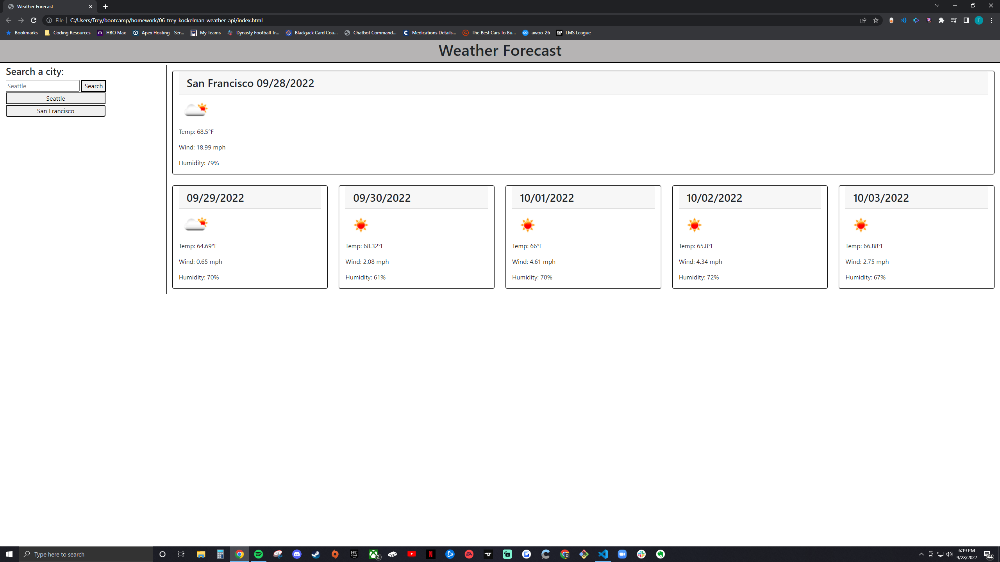

# 06 Trey Kockelman Weather API

## Description

The purpose of this webpage is to give the user a glimpse at the weather for their current time and the next five days. The main technology implemented in this application is a weather API. There were many different challenges to this webpage. The first challenge being working with multiple APIs and having them both create different elements dynamically. Another challenge was getting the styling for those elements to look different while creating them at the same time with the same funciton.

## Installation

NA

## Usage

The use of this page is to provide a 5 day forecast for weather in a given city.

## Credits

NA

## License

NA

## Link

https://treykockelman.github.io/06-trey-kockelman-weather-api/

## Screenshot

